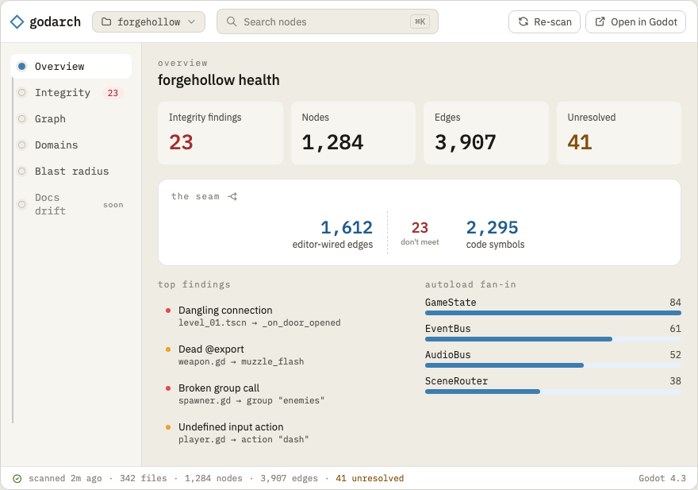

# 03.01 — Wails shell & core binding

`ui/`. The desktop shell. It owns **no analysis logic** — it calls the shared `Pipeline` (00.01) and
renders what comes back. This single-sourcing is why the CLI and app never diverge.

## Mockup

The app shell and the Overview landing screen:



Source: [`mockups/shell.html`](mockups/shell.html) (append `?dark` for the dark theme). See
[`mockups/README.md`](mockups/README.md) for the full set and how to regenerate the PNGs.

## App structure

- Wails v2 project under `ui/`: Go `App` struct + a frontend (Svelte or vanilla TS + Vite, decided
  in 00.04).
- The Go `App` imports `internal/*` exactly as `cmd/godarch` does and exposes bound methods:

```go
func (a *App) OpenProject(dir string) (ProjectSummary, error) // runs Pipeline.Run, saves db, returns counts
func (a *App) RunCheck() ([]report.Finding, error)            // integrity report
func (a *App) GraphView(filter GraphFilter) (GraphDTO, error) // nodes/edges for the explorer
func (a *App) NodeDetail(id string) (NodeDetailDTO, error)    // node + in/out edges + boundaries + findings
func (a *App) BlastRadius(id string, dir Direction) (ReachDTO, error)
func (a *App) RecentProjects() ([]RecentProject, error)
```

- Long-running `OpenProject` emits Wails events for progress (`discover`/`extract`/`resolve`/`done`)
  so the UI shows a real progress bar, not a spinner.

## DTOs

Define thin DTO structs for the frontend (don't leak `model` internals): IDs, display names, kinds,
counts, severities. Keep them JSON-stable and small enough to ship the whole graph for mid-size
projects; paginate/stream only if perf demands (measure first).

## First-run UX (non-dev critical)

- Launch → "Open Godot project folder" button (native folder picker) + recent-projects list.
- Zero required config. `godarch.yml` is optional and discovered if present.
- On open: progress → land on the **integrity report** (the headline) by default; graph + blast
  radius are tabs.
- Persist the `.godarch.db` in the project (or an app-data cache) for instant re-open.
- Clear, friendly errors ("This folder has no project.godot — pick a Godot project").

## Navigation & information architecture

The shell is a fixed frame around a routed content area:

- **Top bar** — wordmark, project switcher (+ recents), global search (`⌘K`, jumps to any node),
  re-scan, and "Open in Godot".
- **Node-spine nav** (left) — the views as nodes strung on a connector line (a nod to Godot's
  scene-tree dock and godarch's own graph). Order follows the value sequence: Overview, Integrity
  (with a live finding-count badge), Graph, Blast radius, then **Domains** (M4) and **Docs drift**
  (M5) shown disabled/"soon" so the roadmap stays legible. The rail collapses to a 48px icon strip
  in the data-dense views (see the graph/blast mockups).
- **Status bar** (bottom) — persistent scan freshness + `nodes · edges · unresolved · Godot version`.
  Keeps the "even v0 prints stats" principle in view and makes staleness obvious.

**Landing screen — Overview.** Rather than dropping straight into the raw report, open on an
Overview that *leads with* the integrity headline (the seam strip + top findings) and previews each
view's key number. This preserves "integrity is the headline" while giving non-devs orientation.
(Open choice: land on Overview vs land directly on Integrity — confirm during build; trivial to flip.)

## Design language

Documented in full in [`mockups/README.md`](mockups/README.md); the load-bearing decisions:

- **Accent** — Godot blue, deepened for contrast: `#3D7DB0` / strong `#1F5C8C`. Status uses semantic
  roles (error red, warning amber, success green, info neutral).
- **Type** — IBM Plex Mono is the *structural voice*: wordmark, nav labels, counts, and every
  identifier/match-key (`signal:Weapon:fired`, `res://…`). IBM Plex Sans for readable prose. Two
  weights only (400/500).
- **Two signatures** — the node-spine nav, and the editor↔code **seam** rendered literally (the
  Overview health strip and the expanded integrity finding both show the break on the seam).
- **Tokens** — CDS-style surface/role custom properties so every view ships in light *and* dark
  (mandatory). The mockups' [`tokens.css`](mockups/tokens.css) is the reference vocabulary.
- **Node-kind ramps** — scene=blue, script=purple, autoload=coral, signal=teal, action=amber,
  scene_node=gray (used by the graph explorer; see 03.02).

## Tasks

- [ ] Scaffold the Wails app; bind the `App` methods above.
- [ ] Implement `Pipeline.Run` progress events → frontend progress bar.
- [ ] Folder picker, recent-projects list, persisted db, re-open flow.
- [ ] DTO layer + JSON contracts the frontend consumes.
- [ ] Error states (no project.godot, parse failures surfaced as diagnostics, empty project).
- [ ] App skeleton navigation: node-spine nav (full + collapsed rail) + view routing.
- [ ] Design tokens (light + dark) + the two signatures (node-spine nav, the seam).
- [ ] Overview landing screen: health metrics, seam strip, top findings, autoload fan-in.
- [ ] Status bar with live scan stats; global `⌘K` search.

## Definition of done

The app opens a real project via folder picker, shows analysis progress, persists the db, and lands
on a (still-to-be-styled) report view — all through the shared core, no duplicated logic.
