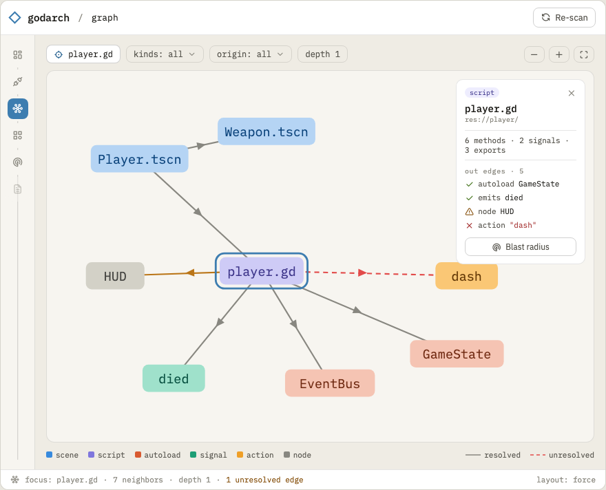

# 03.02 — Graph explorer UI

The visual payoff: one interactive graph spanning **code and editor wiring** — the thing no existing
Godot tool shows (DESIGN §2). Renders the resolved graph from SQLite via the bound `GraphView`.

## Mockup

Focus/ego view on a selected node, with the typed-edge encoding and the detail panel:

Source: [`mockups/graph.html`](mockups/graph.html). Node colour = kind; solid = resolved, dashed
red = unresolved — the `dash` action edge here is the *same* `undefined_action` the integrity view
reports, so the two views reinforce each other. The legend doubles as the kind key.

## Rendering

- **Cytoscape.js** (default) for interactive node-link graphs; **Sigma.js** if a real project blows
  past Cytoscape's smooth-interaction ceiling (measure on the `real/` fixture before deciding).
- Layout: a force/`fcose` layout by default; offer a hierarchical layout for scene-tree/extends views.
- All assets inlined/bundled by Wails — no external CDNs.

## Visual encoding

- **Node kind** → shape/colour (script, scene, autoload, resource, asset, concept).
- **Edge origin** → style: **editor-configured edges visually distinct from code edges** (e.g.
  dashed vs solid) — this is the product's whole thesis; make it legible at a glance.
- **Unresolved edges** → a third style (e.g. red/dotted) so "broken wiring" pops.
- Node size → fan-in (degree) so hubs/god-autoloads are visible without computing M4 metrics.

## Interaction

- Search by name/path; click to select → side panel with `NodeDetail` (in/out edges by type,
  boundary points, attached findings, file:line).
- Filter chips: show/hide by node kind and edge type; "editor edges only" / "unresolved only".
- Focus mode: collapse to a node's N-hop neighbourhood (reuses `BlastRadius`).
- Double-click a file node → jump to source (deep link, 03.04).

## Scoping for usability

A whole-project graph is a hairball. Default to **scoped** views, not the full graph:
- "Scene composition" (instances + attaches_script), "Signal network" (declares/emits/connects),
  "Autoload coupling" (accesses_autoload), "Scene flow" (changes_scene_to).
- Full graph available but behind an explicit toggle.

## Tasks

- [ ] Bundle Cytoscape.js; render `GraphDTO`.
- [ ] Node-kind + edge-origin + unresolved visual encodings; degree-based sizing.
- [ ] Search, select → detail panel (`NodeDetail`).
- [ ] Filter chips (node kind / edge type / editor-only / unresolved-only).
- [ ] Focus / N-hop neighbourhood mode.
- [ ] Preset scoped views (composition / signals / autoload / scene-flow).
- [ ] Perf test on `real/`; fall back to Sigma if needed.

## Definition of done

A real mid-size project renders interactively; editor vs code vs unresolved edges are visually
distinct; selecting a node shows its full detail; scoped preset views make the graph legible.
