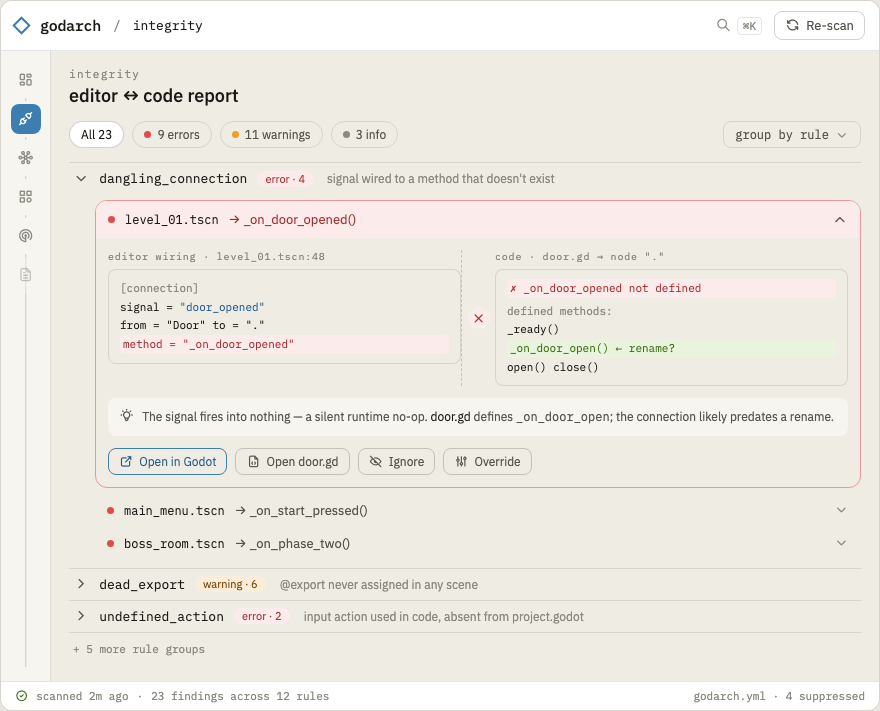

# 03.03 — Integrity report UI

The primary, default view — the M2 report made browsable and actionable for someone who never opens
a terminal. Reads the persisted `findings` table via `RunCheck`.

## Mockup

Findings grouped by rule, with one finding expanded to show the editor↔code seam:

Source: [`mockups/integrity.html`](mockups/integrity.html). The expanded finding realises the
"evidence + what the graph says + suggested fix" detail panel as a literal seam: the `.tscn
[connection]` on the left, the script's actual methods on the right, the missing method flagged and
the likely rename surfaced — proving the finding both-sided rather than asserting it.

## Layout

- **Summary header**: counts by severity (error/warning/info) + unresolved-edge count, as filter
  toggles.
- **Grouped list**: by rule (or by file — toggle). Each finding row: severity icon, title,
  `res://file.gd:line`, one-line message.
- **Detail panel** on select: full message, the evidence snippet, "what the graph says", the
  **suggested fix**, and links to the involved nodes (opens them in the graph explorer).
- **Filters**: severity, rule, path glob, text search. "Show suppressed" toggle.

## Actions

- **Jump to source**: open the file at the line in the user's editor / in Godot (03.04).
- **Open in graph**: focus the involved node(s) in the explorer.
- **Suppress**: write a `suppress` entry to `godarch.yml` from the UI (with a reason field) — makes
  the config approachable for non-devs.
- **Re-run**: re-analyze after the user fixes something in Godot, show the diff (fixed / new).

## Framing for non-devs

- Plain-language rule descriptions with a "why this matters" expander (gamedev terms, not
  graph-theory). E.g. dangling_connection → "A button (or other node) is wired in the editor to call
  a function that doesn't exist anymore — clicking it will do nothing."
- Lead with `error`s; collapse `info` by default.
- Empty state = a clean, reassuring "No integrity issues found 🎉" (validates the false-positive
  discipline from 02.02).

## Tasks

- [ ] Summary header with severity/unresolved toggles.
- [ ] Grouped, filterable findings list (by rule / by file).
- [ ] Detail panel: message, evidence, suggested fix, node links.
- [ ] Jump-to-source + open-in-graph actions.
- [ ] Suppress-from-UI writing to `godarch.yml`.
- [ ] Re-run + fixed/new diff.
- [ ] Plain-language rule copy + "why it matters" content.

## Definition of done

A non-developer can browse, understand, filter, and act on the integrity report end to end — jump to
the offending file, see a suggested fix, suppress a false positive, and re-run — without the CLI.
