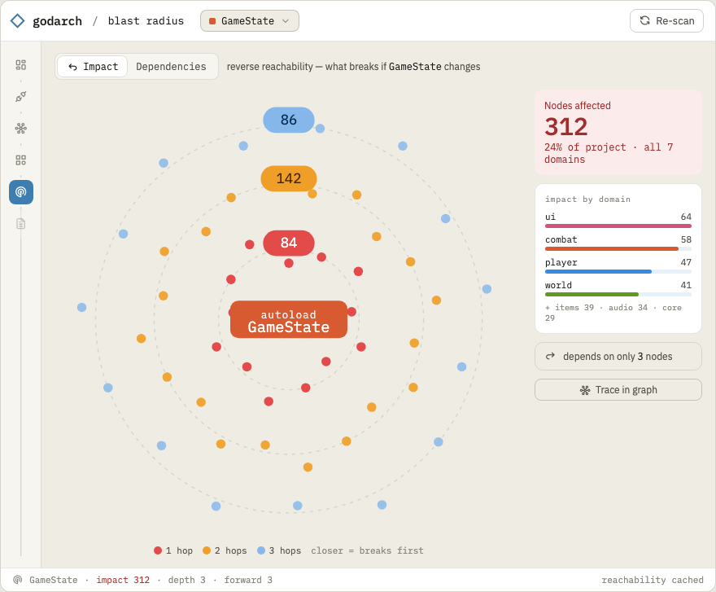

# 03.04 — Blast radius & deep links

Two features that make the graph *actionable*: "what breaks if I change this?" and "take me there".

## Mockup

Reverse reachability ("what breaks if I change this") as concentric impact rings:

Source: [`mockups/blast.html`](mockups/blast.html). Rings = hops from the selected node; heat = how
directly each node breaks; the panel breaks impact down by domain and contrasts the huge reverse
reach (312) against the tiny forward dependency (3) — the god-object signature this view exposes.

## Blast radius

Reads `BlastRadius(id, direction)` → `graph.ForwardReach`/`ReverseReach` (00.03).

- **Reverse reach** ("who depends on me"): select a node → highlight everything that references it,
  transitively. The headline question for a refactor: *if I rename/delete this signal/scene/autoload,
  what is affected?*
- **Forward reach** ("what this touches"): from an ingress (e.g. an input action handler) → the
  causal chain of edges to terminal egress. The seed of "walks" (M4 makes these first-class).
- Present as: a highlighted subgraph in the explorer + a flat impact list (files, grouped by kind)
  with counts and a cycle warning if the reach loops.
- Special-case autoloads: "this singleton is referenced by N scripts across M directories" — the
  cheap, pre-M4 sprawl signal.

## Deep links (take me there)

- **Open file at line**: launch the user's configured editor (`$EDITOR` / VS Code) at `file:line`,
  or reveal in OS file manager. Configurable; sensible default per OS.
- **Open in Godot**: Godot supports an editor remote/`--path`; at minimum, open the project in Godot
  and (best-effort) the relevant scene. Investigate Godot's CLI/remote-debug hooks for jumping to a
  scene/script; fall back to "reveal file" if no clean hook exists. Document what's achievable.
- These links appear in the integrity report rows and the graph node detail panel.

## Tasks

- [ ] `BlastRadius` reverse + forward views; subgraph highlight + flat impact list.
- [ ] Cycle detection surfaced in the reach view.
- [ ] Autoload "referenced by N across M dirs" callout.
- [ ] Open-file-at-line (editor + file-manager fallback), per-OS defaults, configurable.
- [ ] Spike "open in Godot" (project + scene); document the achievable depth; implement the best
      available.

## Definition of done

Selecting any node shows a correct reverse/forward reach with an impact list; report rows and node
panels can open the source at the right line; "open in Godot" works to at least the project level.
